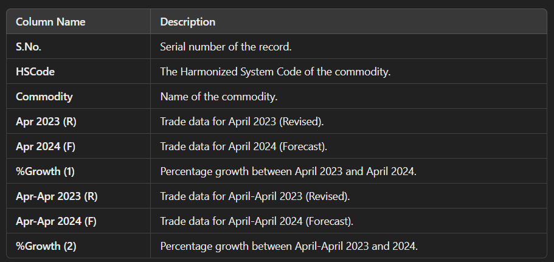

# **Web Scraping Project - Data Collection from Tradestat**

**Overview**
----------------------------------------------------------------
This project is designed to scrape trade data for multiple countries, years, and months from the Tradestat website using Selenium. The scraped data includes HS Codes, commodity information, and trade growth for specified countries and time periods. The collected data is saved in CSV format for further analysis.

**Technologies Used**
----------------------------------------------------------------
* Python 3.x
* Selenium: Used for web scraping and automating browser interactions.
* Pandas: Used for organizing and saving scraped data into CSV files.
* WebDriver (Chrome): For browser automation.

**Features**
----------------------------------------------------------------
* Scrapes trade data from the Tradestat website for multiple countries, years (2007-2024), and months (January to December).
* Selects country, year, month, and other filters dynamically using Selenium WebDriver.
* Saves the scraped data into CSV files in a structured format.
* Runs in headless mode for efficient scraping without UI rendering.
* Implements error handling and retry mechanisms in case of failures.

**Setup**
----------------------------------------------------------------
Prerequisites
To run this project, you will need the following:

* Python 3.x installed on your system.
* Selenium package for Python.
* ChromeDriver: Compatible with your version of Google Chrome.

**Installation**
1) Install the necessary Python libraries by running:
* pip install selenium pandas

2) Download ChromeDriver:
* Visit ChromeDriver to download the appropriate version of ChromeDriver for your system.
* Extract the ChromeDriver to a location of your choice and add it to your system’s PATH.

3) Configuration
* The script is configured to run in headless mode (without opening the Chrome browser UI), which makes it more efficient for running on servers or systems with limited resources.
* The scraped data is saved in the scraped_data/ folder. Make sure you have write permissions for that directory.

**Running the Project**
----------------------------------------------------
* Clone the repository or download the script files.
* Open a terminal or command prompt.
* Run the script using the following command:  python scrape_data.py

This will start scraping data for all the listed countries, years, and months. The results will be saved as CSV files in the scraped_data/ folder.

**Data Structure**
----------------------------------------------------
* Each CSV file will contain the following columns:

**Error Handling & Retries**
----------------------------------------------------
* The script handles TimeoutException and StaleElementReferenceException during web scraping.
* It will automatically retry up to 3 times if an error occurs during the scraping process.

**Troubleshooting**
----------------------------------------------------
1) Issue: No data scraped

* Make sure your internet connection is active.
* Ensure ChromeDriver is installed correctly and matches the version of Google Chrome.
2) Issue: Permissions error

* Ensure the scraped_data/ folder is writable.

**License**
----------------------------------------------------
This project is licensed under the MIT License - see the LICENSE file for details.